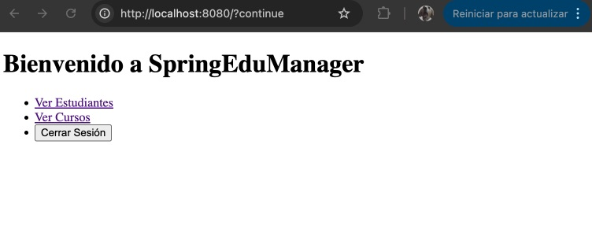
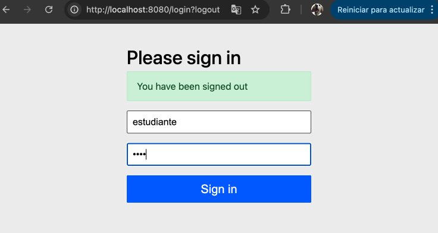
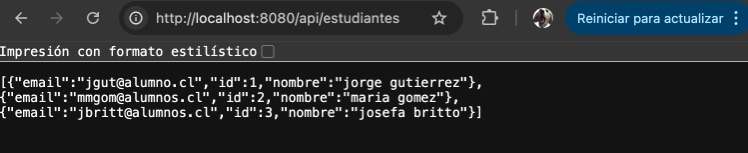
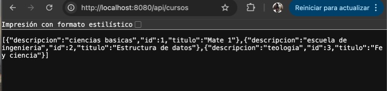

# 🎓 SpringEduManager

[cite_start]Proyecto final del Módulo 6: "Desarrollo de aplicaciones JEE con Spring framework"[cite: 6]. 

[cite_start]Esta es una aplicación web educativa desarrollada progresivamente en Java utilizando el ecosistema de Spring[cite: 13]. [cite_start]Permite a la Coordinación Académica de un bootcamp gestionar estudiantes, cursos y evaluaciones en una plataforma centralizada[cite: 8, 9].

## 🚀 Tecnologías Utilizadas

[cite_start]El proyecto fue construido utilizando buenas prácticas de estructuración y modularización[cite: 81], integrando las siguientes tecnologías:

* **Lenguaje:** Java 22

* [cite_start]**Gestor de dependencias:** Maven [cite: 16]

* **Framework Principal:** Spring Boot

* [cite_start]**Arquitectura web:** Spring MVC [cite: 17] y Thymeleaf (para las vistas HTML)

* [cite_start]**Persistencia de datos:** Spring Data JPA con base de datos en memoria H2 [cite: 18]

* [cite_start]**Seguridad:** Spring Security [cite: 19]

* [cite_start]**Interoperabilidad:** APIs RESTful [cite: 20]

## ⚙️ Características Principales

1.  [cite_start]**Patrón MVC:** Implementación estructurada con controladores, modelos (Estudiante, Curso) y vistas web operativas[cite: 39, 83, 108].

2.  [cite_start]**Base de Datos en Memoria:** Uso de H2 para persistir y consultar registros de forma ágil mediante repositorios JPA[cite: 54, 56].

3.  [cite_start]**Seguridad por Roles:** Sistema de login y logout funcional que protege las rutas de la aplicación[cite: 62, 63]. [cite_start]La vista para ingresar nuevos cursos está restringida únicamente para administradores[cite: 64].

4.  [cite_start]**Servicios REST:** Exposición de endpoints para operaciones CRUD de estudiantes y cursos, devolviendo respuestas en formato JSON[cite: 71, 77, 86].

## 🛠️ Instalación y Ejecución

Para correr este proyecto en tu entorno local, clona este repositorio y utiliza el wrapper de Maven incluido:

\`\`\`bash

# 1. Limpiar y compilar el proyecto

./mvnw clean compile

# 2. Levantar el servidor

./mvnw spring-boot:run

\`\`\`

Una vez que la aplicación indique que ha iniciado, abre tu navegador en `http://localhost:8080`.

## 🔐 Credenciales de Prueba

[cite_start]El sistema cuenta con dos usuarios configurados en memoria para probar el control de acceso[cite: 61, 62]:

* **Administrador (Rol ADMIN):**

    * Usuario: `admin`

    * Contraseña: `admin`

    * [cite_start]*Permisos:* Acceso total, incluyendo la creación de nuevos cursos[cite: 64].

* **Estudiante (Rol USER):**

    * Usuario: `estudiante`

    * Contraseña: `1234`

    * [cite_start]*Permisos:* Acceso a listados, pero acceso denegado a la creación de cursos[cite: 64].

## 📡 Endpoints de la API REST

[cite_start]Además de la interfaz web, el sistema expone los siguientes servicios RESTful[cite: 86]:

* **Estudiantes:**

    * `GET /api/estudiantes` - Retorna la lista de todos los estudiantes registrados.

    * `POST /api/estudiantes` - Permite guardar un nuevo estudiante (enviando un JSON en el cuerpo de la petición).

* **Cursos:**

    * `GET /api/cursos` - Retorna la lista de todos los cursos disponibles.

    * `POST /api/cursos` - Permite guardar un nuevo curso.

## 📸 Evidencias Funcionales

(docs/98A54ECF-17BA-427F-83AF-A1CE14DBCBCF_4_5005_c.jpeg)

![Admin creando cursos] (docs/B6A2F387-E66E-40A9-B235-EDAB435E9566_4_5005_c.jpeg)

![Admin creando estudiantes] (docs/F233B7D1-55F8-4C63-9975-F0B069184F65_4_5005_c.jpeg)

---

*Desarrollado como proyecto integrador para Alkemy.*